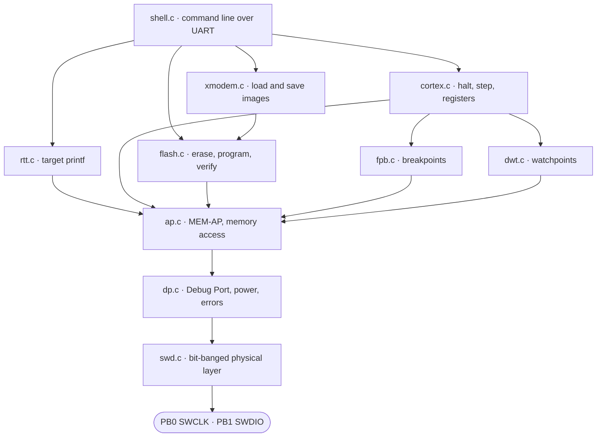

# ADIv5-AVR

An 8-bit AVR that debugs an ARM Cortex-M4. Bit-banged SWD, bare metal, no probe chip and
no level shifter. One resistor and four jumper wires.

```
   PC ──USB/115200── ATmega328P ──SWCLK──▶ STM32F411
                     (Arduino Uno)         (Black Pill)
                          │  ◀──SWDIO──▶       │
                       5V/16MHz              3.3V
```

`18.6KB flash · 322B RAM` on the AVR. Halt, step, breakpoints, watchpoints, flash
programming, RTT.

## Why

Every practical SWD host leans on dedicated hardware: an ST-Link, a CMSIS-DAP probe, or at
minimum a level shifter between 5V and 3.3V logic. This removes all of it and implements
ADIv5 directly against the target's 5V-tolerant pins.

## Related work

Bit-banged SWD is not new. [pirate-swd](https://github.com/willdonnelly/pirate-swd)
drives the protocol from a Bus Pirate with the logic in Python on the PC.
scanlime's ESP8266 implementation, [ported to xpcc](https://github.com/ekiwi/xpcc-swd)
for an STM32F3 host, runs the protocol on the microcontroller itself. Black Magic
Probe is the complete version: a GDB server, flash drivers for many families, on a
32-bit STM32.

What is unusual here is the combination. The host is 8-bit, with 2KB of RAM and no
USB. Everything lives on it: the protocol, the Cortex-M debug logic, the flash
driver, XMODEM and the command line. FPB breakpoints, DWT watchpoints and RTT are
not usually on the list of things that fit alongside all of that in 18KB. And there
is no probe silicon and no level shifter in the path, only a resistor.

## Wiring

```
Arduino Uno                    Black Pill
───────────                    ──────────
5V  ────────────────────────── 5V
GND ────────────────────────── GND
D8  (PB0) ──────────────────── PA14  SWCLK
D9  (PB1) ──────┬───────────── PA13  SWDIO
                │
             [2.2kΩ]
                │
                └───────────── 3V3
```

- PA13/PA14 are 5V-tolerant, which is what makes the direct connection safe.
- SWCLK is push-pull and always an output.
- SWDIO is never driven high. Low is driven, high is released and the resistor pulls it to
  3.3V, so SWDIO never sees 5V and cannot contend with the target.
- A bad ground makes every logic level meaningless and looks exactly like a protocol bug.

## Quick start

```sh
make flash                   # build and flash the AVR host
make target-flash            # build target/blink.bin and program the STM32
screen /dev/ttyACM0 115200   # or drive it by hand
```

```
> i
DPIDR  0x2BA01477     ARM SW-DP
AP IDR 0x24770011     AHB-AP
CPUID  0x410FC241     Cortex-M4 r0p1
DBGMCU 0x10006431     STM32F411
```

## Architecture



| Layer | Does |
|-------|------|
| `swd.c` | Clock and data bit-banging, turnaround, line reset, transfers |
| `dp.c` | Debug Port: connect, power domains, sticky error recovery |
| `ap.c` | MEM-AP: memory at byte, halfword and word size, block transfers |
| `cortex.c` | Halt, resume, reset-halt, stepping, core registers |
| `fpb.c` `dwt.c` | Hardware breakpoints and data watchpoints |
| `flash.c` | Geometry probe, sector and mass erase, program, verify, option bytes |
| `xmodem.c` `rtt.c` | Image transfer both ways, and target `printf` |
| `shell.c` | The command line |

## Commands

Addresses and values are hex. Counts, sizes and slots are decimal.

| | | | |
|---|---|---|---|
| `c` | connect | `b [addr]` | list or set a breakpoint |
| `i` | DPIDR, AP IDR, CPUID, DBGMCU | `k [slot]` | clear breakpoints |
| `s` | status, halted and lockup | `a [addr] [rwb]` | list or set a watchpoint |
| `r <addr> [sz]` | read, size 1, 2 or 4 | `j [slot]` | clear watchpoints |
| `w <addr> <val> [sz]` | write, same sizes | `f` | flash size and sector map |
| `d <addr> [n]` | dump n words | `u` | unlock flash |
| `h` `g` | halt, resume | `e <sect\|addr>` | erase a sector |
| `t` `q` | reset and halt, reset and run | `p <addr> <val>` | program a word |
| `n [n]` `m [n]` | step, step with interrupts masked | `z` `v` | mass erase, drop protection |
| `x [reg] [val]` | core registers | `o` | option bytes and protection |
| `l <addr>` | load a binary over XMODEM | `y <addr> <len>` | save memory to a file |
| `rtt [base] [len]` | stream target output | `?` | help |

## Things that cost time

| | |
|---|---|
| Turnaround is asymmetric | The park bit covers host to target. Target to host needs two clocks. |
| One extra clock breaks the ACK | A real OK reads as FAULT, and everything after it desyncs. |
| CSW needs its Prot bits | Without `0x23000000` the AHB access is rejected and STICKYERR latches. |
| Sub-word data rides in byte lanes | A byte at `...03` arrives in bits [31:24], not at the bottom. |
| TAR auto-increment stops at 1KB | Rewrite it at every boundary. |
| Timeouts belong in milliseconds | Poll counts shrank a hundredfold when the SWD clock went up. |
| Halt before touching flash | An erase never finishes while the core fetches from that flash. |
| A locked flash controller lies | Writes to FLASH_CR are ignored and the operation reports success. |
| Sticky errors outlive line resets | Only a write to ABORT clears them. |
| Dropped UART bytes surface late | No receive interrupt meant a lost command failed five steps later. |

Full detail, and the bugs behind each one, in [docs/NOTES.md](docs/NOTES.md).

## Footprint

| | Used | Of |
|---|---|---|
| Flash | 18616 B | 32 KB |
| SRAM | 322 B | 2 KB |

String literals live in `PROGMEM`. Before that, `.data` alone was 1396 bytes and there was
barely enough stack left for XMODEM's 128 byte buffer.

## Layout

```
src/ include/    AVR firmware
target/          a small STM32 blinky, to test the whole chain
tools/swdflash   host side flasher: drives the shell, sends the image
tools/swdmon     dumps whatever the board sends
docs/NOTES.md    engineering notes
```

## References

- **ARM Debug Interface v5** (ARM IHI 0031A). DP and AP registers, packet format, ACK
  encoding, parity, turnaround, CSW. Predates the JTAG-to-SWD sequence, so `0xE79E` is not
  in it.
- **ARMv7-M Architecture Reference Manual** (ARM DDI 0403). DHCSR, DEMCR, AIRCR, the
  `0xA05F` key, DCRSR and DCRDR, FPB and DWT.
- **STM32F411 reference manual** (RM0383) **and datasheet**. Flash controller, option
  bytes, sector layout, PA13/PA14 defaults, 5V-tolerant pins, BOOT0.
- **ATmega328P datasheet**. DDR, PORT and PIN semantics, USART, U2X baud.
